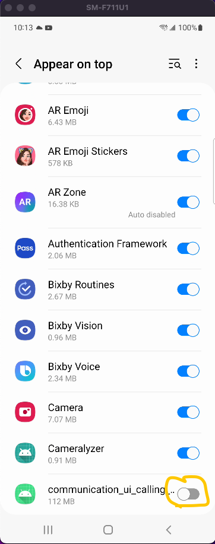
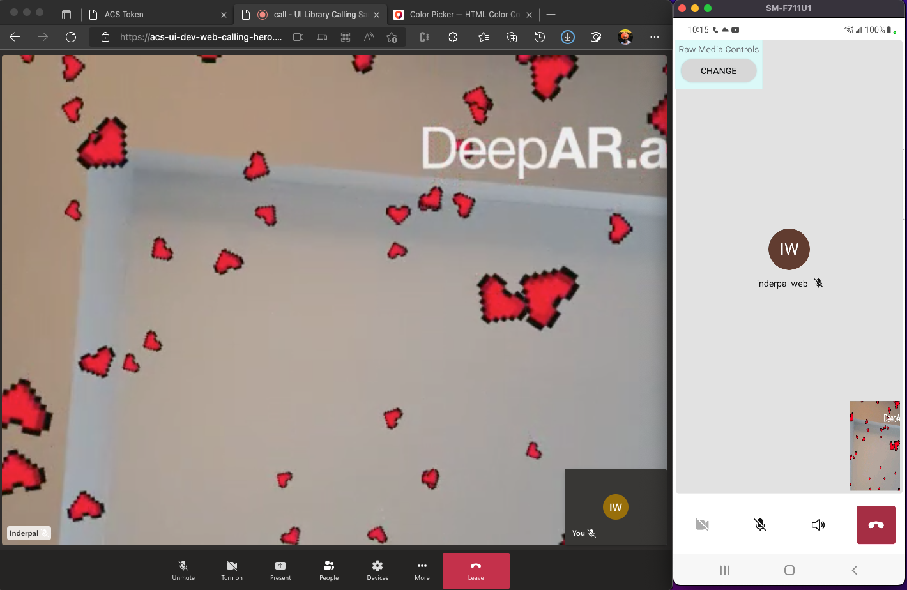

# Azure Communication UI Mobile Library integration with DeepAR

Azure Communication [UI Mobile Library](https://docs.microsoft.com/en-us/azure/communication-services/concepts/ui-library/ui-library-overview)

DeepAR [Deep AR](https://www.deepar.ai/) 

## Getting Started

- Clone UI Library branch [inderpalaulakh/communication-ui-library-android/tree/feature/raw_media](https://github.com/inderpalaulakh/communication-ui-library-android/tree/feature/raw_media) and generate .aar by executing `./gradlew build`
- Copy generate `calling-release.aar` to `communication-ui-library-android-deep-ar/lib`. 
- Register at [Deep AR](https://www.deepar.ai/). Generate Android project with application id `com.communication.ui.calling.deep.ar`.
- Follow [Android Azure Communication UI Library](https://learn.microsoft.com/en-us/azure/communication-services/quickstarts/ui-library/get-started-composites?tabs=kotlin&pivots=platform-android) to generate `ACS Token`, `Group Call ID`.
- In `communication-ui-library-android/azure-communication-ui/local.properties/local.properties` paste below key's

```groovy
GROUP_CALL_ID=""
DISPLAY_NAME=""
ACS_TOKEN=""
DEEP_AR_KEY=""
```

## Build Application
- Build App
- Press Launch button
- Enable `appear on top`
  


- Accept camera permissions
- Press `Launch` button
- Press `Join Call` button
- Join call with remote participant
- Press `Start` button for raw media controls
- On remote participant join, video from your device will start. Remote participant will see stream with DeepAR effects.



* Code changes to ACS Ui library and sample application in this repo is POC(Proff of concept) code. Code cleanup is required for production code.
